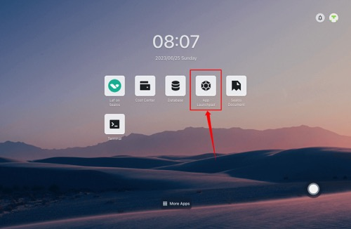
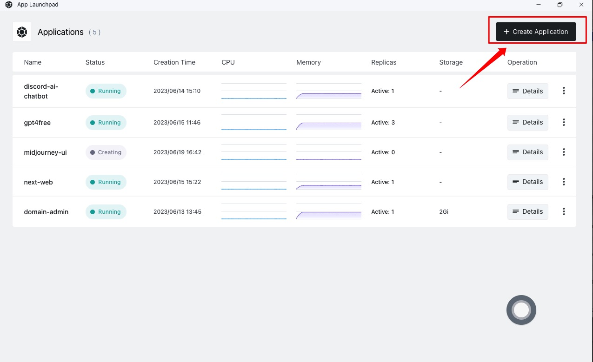
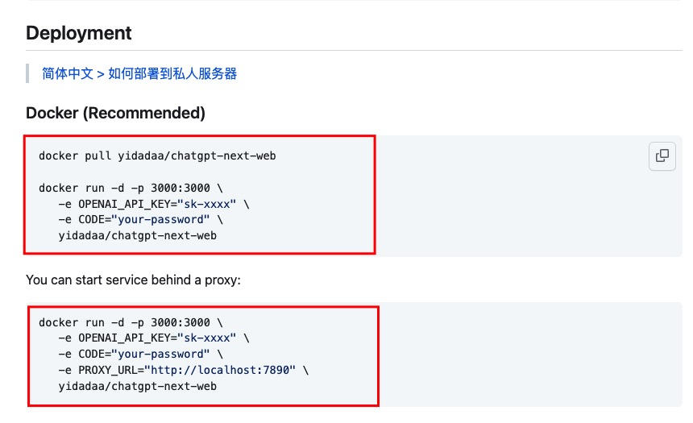
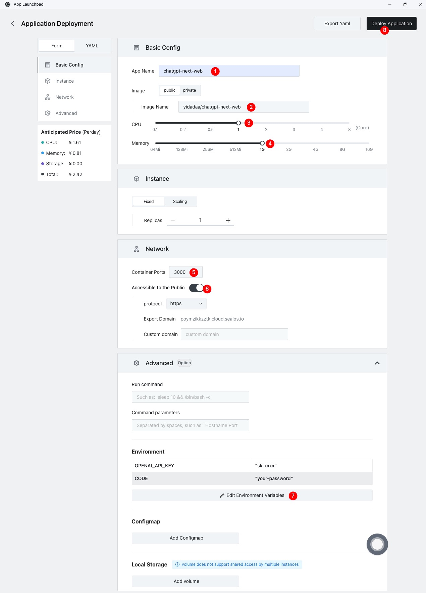
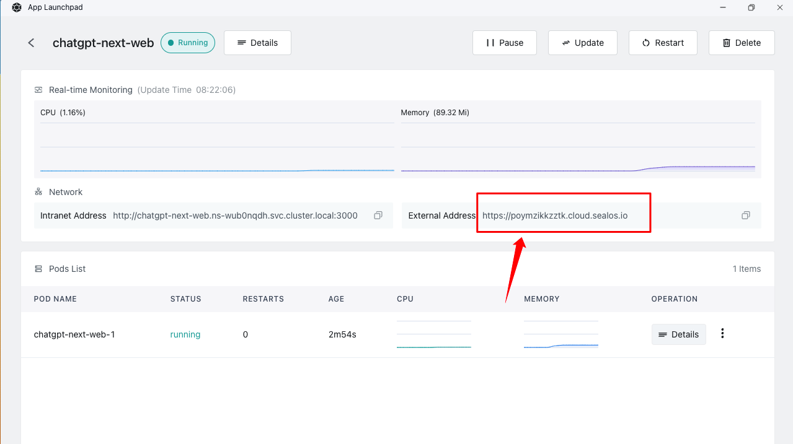
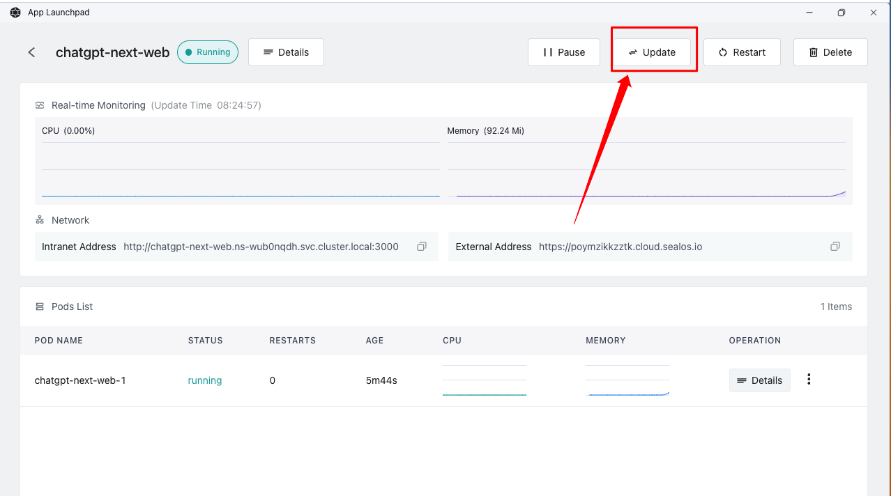
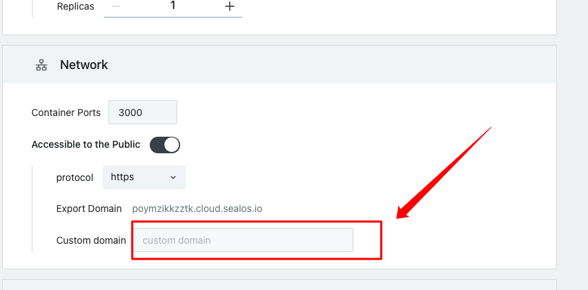

# 快速安装 ChatGPT-Next-Web

A well-designed cross-platform ChatGPT UI (Web / PWA / Linux / Win / MacOS). 一键拥有你自己的跨平台 ChatGPT 应用。具体可查阅 [ChatGPT-Next-Web Git](https://github.com/Yidadaa/ChatGPT-Next-Web)。

## 第 1 步：打开「应用管理」应用



## 第 2 步：点击「创建应用」



## 第 3 步：应用部署

查看 GitHub 部署信息



按照 GitHub docker 相关配置填入信息



按照 1-8 的顺序依次操作

>App Name: chatgpt-next-web (可随意填写)
>
>Image Name: yidadaa/chatgpt-next-web
>
>CPU: 1Core
>
>Memory: 1G
>
>Container Ports: 3000
>
>Accessible to the Public: On
>
>AEnvironment: 环境变量参考下方配置

环境变量配置如下：

:::tip
OPENAI_API_KEY 填写你的 Openai Key

CODE 填写你的登录密码
:::

```env
OPENAI_API_KEY="sk-xxxx"
CODE="your-password"
```

## 第 4 步：部署完成

稍等 30 秒 -1 分钟，网站即可部署成功



点击此处链接即可进入 ChatGPT-Next-Web

## 第 5 步：绑定自己的域名

:::tip
该步骤不是必须的，sealos 默认会分配一个域名给应用。
:::





点击「Custom Domain」

按照提示，CNAME 解析一个域名到 Sealos 分配的域名。然后将分配的域名填入 sealos，即可使用自己的域名和网站。
